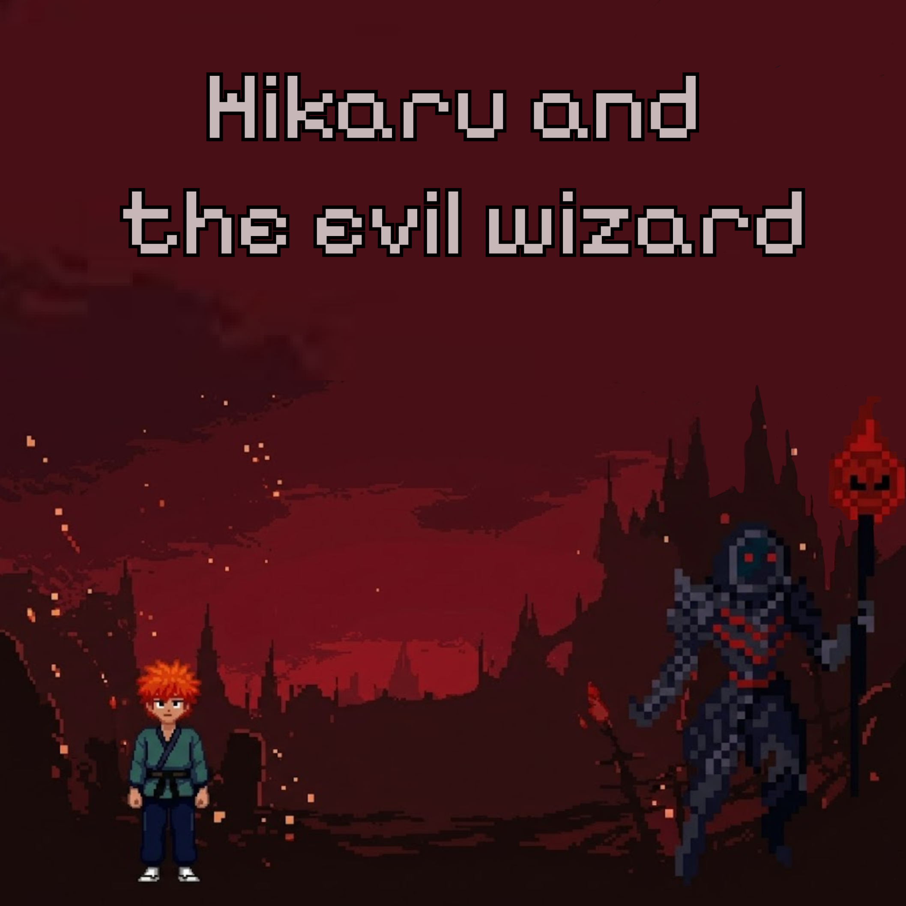

# Hikaru and the evil wizard

  

## 🎮 Unity Version
 6000.0.58f2 (LTS)

## ⚙️ Setup
1. Clone this repo
2. Open in Unity Hub using the version above
3. Open scene `Assets/Scenes/MainScene.unity`
4. Press Play

## 💡 Branching Strategy
- `main` → stable builds
- `dev` → main development
- feature branches: `dev_player-movement`, `dev_enemy-ai`, etc.
